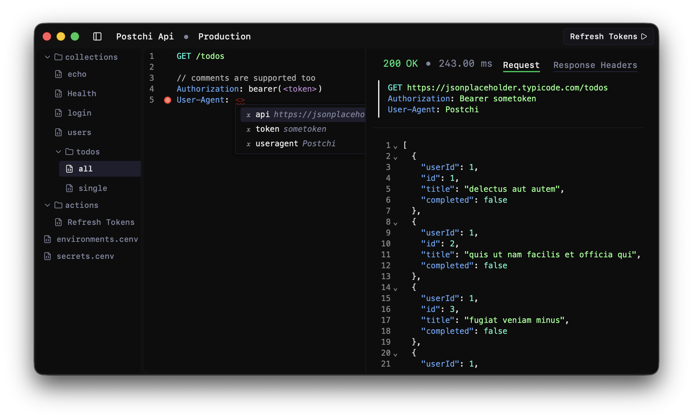

# Postchi is an api client aimed at being focused, clean, light weight and feature rich

Postchi is a paid software but a free version is also available, checkout [getpostchi.com](https://getpostchi.com)

## Stack

Postchi is built using [Tauri](https://tauri.app) and [react](https://react.dev) and is written in typescript.
