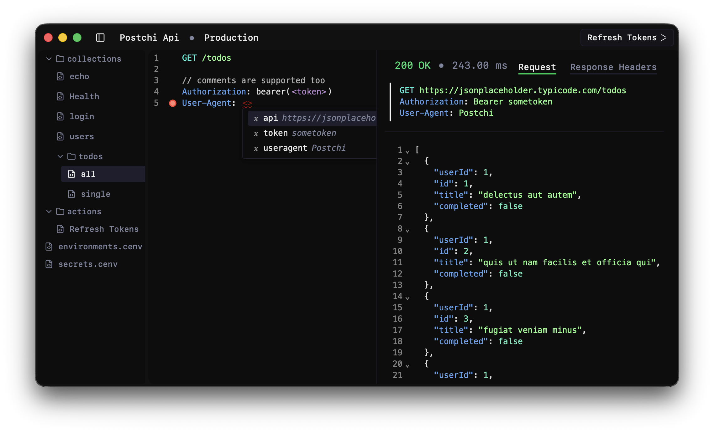

# Postchi is an api client aimed at being focused, clean, light weight and feature rich

Postchi is free for personal use, checkout [getpostchi.com](https://getpostchi.com)

## Highlights
Local, Plain text files: everything is stored as plain text in the same format you see in the app itself.

Open Api Integration: postchi can sync with open apis and provide autcomplete and linting based on the spec.

Scripts: before and after scripts for requests and folders.

Actions: standalone scripts that are not attached to any request.
 

## Stack

Postchi is built using [Tauri](https://tauri.app) and [react](https://react.dev) and is written in typescript.
